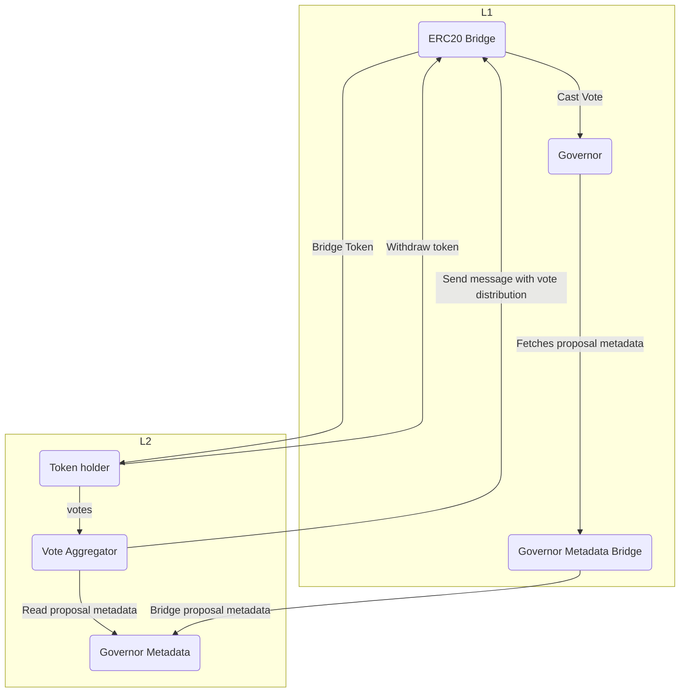

# L2 Flexible Voting

**This codebase contains smart contracts that enable governance voting from Layer 2 rollups using bridged tokens. The current implementation is an MVP. These contracts have not yet been audited or deployed in production. Use at your own risk.**

- [About](#about)
- [Architecture](#architecture)
- [Testing](#testing)
- [License](#license)


## About

[Flexible Voting](https://www.scopelift.co/blog/introducing-flexible-voting) is a Governor extension that enables arbitrary voting contracts to be developed, allowing token holders to maintain their voting rights even when they deposit tokens in DeFi or any other contract.

This codebase contains smart contracts that enable governance voting from Layer 2 rollups using bridged tokens. Today, when a user deposits their governance token into a bridge, they lose access to the voting rights of that token. These contracts allow holders of bridged governance tokens to vote on Layer 2—paying the lower gas fees these networks offer—then see their votes reflected on Layer 1 in a trust minimized fashion.

The current implementation was built with a grant from the Ethereum Foundation. It is a minimum viable product, demonstrating the feasibility of such a system with a set of contracts that *could* be deployed in production. Please note these contracts have not yet been audited, and should be used only with caution in their current state.


## Architecture

This diagram represents the architecture of the current implementation.



Let's review each component individually and summarize its role in the system.


#### On Layer 1

* __Governor__ - The DAO's Flexible Voting compatible governance contract.
* __Governor Metadata Bridge__ - Contract that reads governance proposal metadata from the Governor and sends it to L2.
* __ERC20 Bridge__ - Contract where users lock their tokens to bridge them to L2. Also receives the aggregated votes from L2 and forwards them (via Flexible Voting extension) to the Governor.

#### On Layer 2

* __Bridged ERC20__ - The delegation-enabled ERC20 voting contract the user receives on L2.
* __Governor Metadata__ - The contract that receives governance proposal metadata sent from L1 and makes it available to the vote aggregator.
* __Vote Aggregator__ - The contract that collects the votes of holders of the bridged governance token on L2 and forwards the aggregated votes back to L1.

## Development

### Foundry

This project uses [Foundry](https://github.com/foundry-rs/foundry). Follow [these instructions](https://github.com/foundry-rs/foundry#installation) to install it.


#### Getting started

Clone the repo

```bash
git clone git@github.com:ScopeLift/l2-flexible-voting.git
cd l2-flexible-voting
```

Copy the `env.sample` file and populate it with values

```bash
cp env.sample .env
# Open the .env file and add your values
```

```bash
forge install
forge build
forge test
```

### Formatting

Formatting is done via [scopelint](https://github.com/ScopeLift/scopelint). To install scopelint, run:

```bash
cargo install scopelint
```

#### Apply formatting

```bash
scopelint fmt
```

#### Check formatting

```bash
scopelint check
```

## Scripts

This repository contains a series of Foundry scripts which can be used to deploy and exercise the contracts on testnets or real networks.

* __Deploy.s.sol__ - Deploy L1 bridge and corresponding token to be minted on L2
* __DeployFakeERC20.s.sol__ - Deploys an ERC20 on any chain. It is used to create a token for the L1 Governor when testing
* __DeployGovernorMetadata.s.sol__ - Deploy the L2 GovernorMetadata contract along with the L1 GovernorMetadata bridge
* __DeployVoteAggregator.s.sol__ - Deploys an L2 vote aggregator contract to test collecting votes on L2
* __MintOnL2.s.sol__ - Calls the bridge on L1 which will call the mint function on the L2 token.
* __SendProposalToL2.s.sol__ - Create an L1 and L2 governor metadata contract, and have the L1 contract pass a proposal to the L2 metadata contract.

These scripts are meant for end-to-end testing on real networks. They should not be used as-is for production deployments.

## License

This project is available under the [MIT](LICENSE.txt) license.

Copyright (c) 2023 ScopeLift
