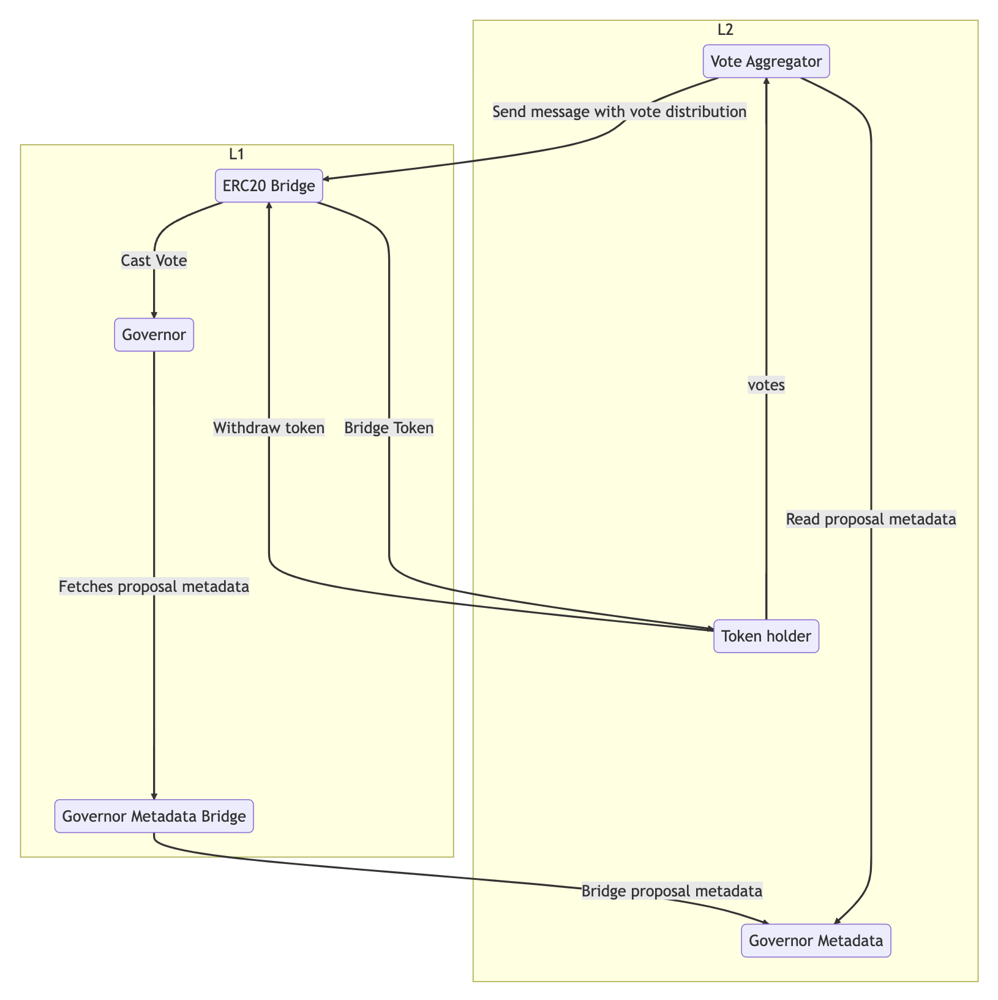

# L2 Flexible Voting

⚠️ **This codebase is a work in progress and not meant to be used in a production setting.**

- [About](#about)
- [Architecture](#architecture)
- [Testing](#testing)
- [License](#license)


## About

[Flexible voting](https://www.scopelift.co/blog/introducing-flexible-voting) is a Governor extension that allows arbitrary delegate contracts to be developed. Allowing token holders to maintain their voting rights even when they choose to use their tokens in Defi or any other contract that supports flexible voting.

In this repo, we are building a production ready proof of concept for Layer 2 flexible voting. When a user deposits their governance token into a bridge they lose access to the voting rights of that token. We hope to solve this problem and allow for token holders to take advantage of the gas fees on Layer 2.


## Architecture

Our initial architecture is shown in the diagram below. This provides a high level overview of what we plan to build and is subject to change.

<div align="center">
  
</div>


## Testing

To currently test the bridge add a wallet private key that has some native tokens on avalanche fuji
and polygon mumbai. Then run the below docker commands to setup the spy and local redis node.

```
docker run --rm -p6379:6379 --name redis-docker -d redis 


docker run \
    --platform=linux/amd64 \
    -p 7073:7073 \
    --entrypoint /guardiand \
    ghcr.io/wormhole-foundation/guardiand:latest \
spy --nodeKey /node.key --spyRPC "[::]:7073" --network /wormhole/testnet/2/1 --bootstrap
 /dns4/wormhole-testnet-v2-bootstrap.certus.one/udp/8999/quic/p2p/12D3KooWAkB9ynDur1Jtoa
97LBUp8RXdhzS5uHgAfdTquJbrbN7i
```

Once those are running you will need to setup the L2 relayer. Follow the instructions 
[here](https://github.com/ScopeLift/l2-wormhole-relayer-engine). Now, you should be able to run 
the `MintOnL2` script demonstrating passing a  message cross-chain.

## License

This project is available under the [MIT](LICENSE.txt) license.

Copyright (c) 2023 ScopeLift
